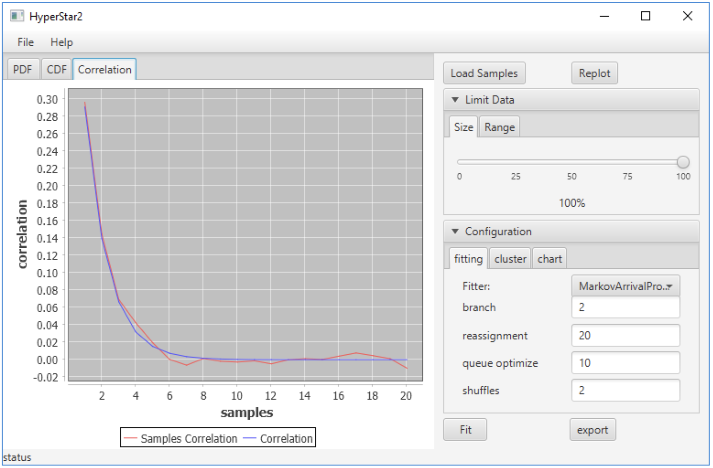

# HyperStar2

## Functionality

HyperStar2 is a JavaFX desktop tool for fitting time-series interval samples to phase-type models.

- Load samples from a text file, one numeric value per line.
- Limit fitting data by:
  - percentage of samples (`Size` slider),
  - value range (`from` / `to`).
- Plot sample-driven charts:
  - `PDF` tab: histogram of samples,
  - `CDF` tab: empirical cumulative distribution,
  - `Correlation` tab: empirical autocorrelation (shown when MAP fitting is used).
- Fit supported models from the `Configuration -> fitting` tab:
  - `Exponential`,
  - `Erlang` (moment-based),
  - `Hyper-Erlang` (k-means initialization + iterative reassignment/shuffle refinement),
  - `MarkovArrivalProcess` (MAP; built from Hyper-Erlang structure, with optional PSO for D1 optimization).
- Overlay fitted curves on charts after `Fit`:
  - fitted PDF over histogram,
  - fitted CDF over empirical CDF,
  - fitted autocorrelation over empirical autocorrelation for MAP.
- Interact with PDF chart:
  - left-click to add peak markers.
- Export current fit result (`alpha/Q` or `D0/D1`) to a text file via `Export`.

Paper: [HyperStar2](https://doi.org/10.1145/3030207.3030243)

## GUI



## Sample Data

The repository includes user-facing example datasets in `samples/`:

- `samples/exp_samples.txt`
- `samples/gamma_samples.txt`
- `samples/her.txt`

To try them, run the app and load any file through the sample import/open flow (one numeric value per line).

## Run

```bash
./gradlew run
```

```powershell
.\gradlew.bat run
```
